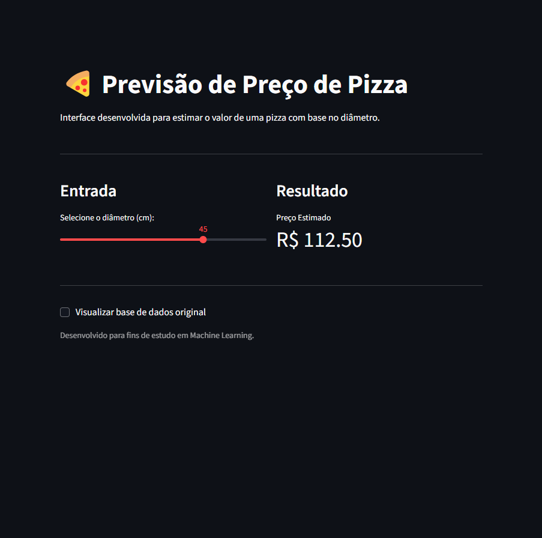

# 🍕 PizzaPrice AI - Preditor de Preços

<p align="center">
  
</p>

Este projeto utiliza **Machine Learning** para prever o preço de uma pizza com base no seu diâmetro, utilizando um modelo de **Regressão Linear**. Foi desenvolvido como parte dos meus estudos em IA e demonstra o ciclo completo de uma solução de dados.

## 🚀 Tecnologias Utilizadas
- **Python 3.13**: Versão mais recente para máxima performance.
- **Pandas**: Manipulação e análise estruturada de dados.
- **Scikit-Learn**: Criação, treinamento e avaliação do modelo de Machine Learning.
- **Streamlit**: Framework para criação de dashboards e interfaces web interativas.
- **Poetry**: Gestão moderna de dependências e ambientes virtuais.

## 📊 O Projeto
O objetivo é demonstrar o fluxo completo de um projeto de Ciência de Dados:
1. **Coleta**: Dados estruturados sobre diâmetro e preço salvos em CSV.
2. **Treinamento**: Aplicação do algoritmo de Regressão Linear para encontrar a correlação matemática entre as variáveis.
3. **Interface**: Dashboard que permite ao usuário interagir com o modelo em tempo real.

## 🛠️ Como rodar o projeto localmente
Para replicar este ambiente, você precisará do [Poetry](https://python-poetry.org/) instalado.

1. Clone o repositório:
   ```bash
   git clone [https://github.com/elias-ml-dev/projeto-ml-pizzas.git](https://github.com/elias-ml-dev/projeto-ml-pizzas.git)